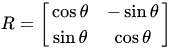
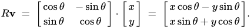

20200603200623

### Rotation Matrix 

is used to perform a rotation in Euclidean Space.

Examples:

Rotate a point (x,y) in 2D space counter-clockwise through angle theta:

#linearalgebra #math #euclidean #graphics #robotics #computervision #gamedev
